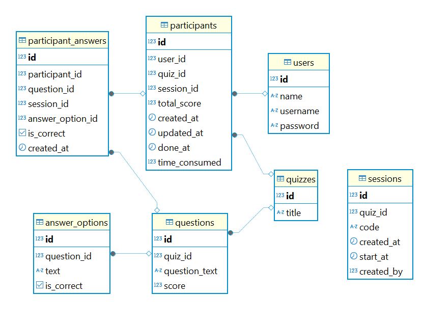

# Real-time Quiz

### Demo link: 
https://btaskee.up.railway.app/

### Account:
>user1  
password: abcd

>admin  
password: admin

### Video demo

https://www.youtube.com/watch?v=kpZIwkkAm0k

### Technical information 
- Go
- PostgreSQL
- Websocket
- JWT

### Database

* <code>users</code>: thông tin người dùng
* <code>quizzes</code>: bộ đề bài
* <code>questions</code>: câu hỏi trong bộ đề
* <code>answer_options</code>: đáp án trắc nghiệm, chỉ có 1 đáp án <code>is_correct=true</code>
* <code>sessions</code>: phiên chơi, mỗi user có thể tạo nhiều phiên cho cùng bộ đề, và có thể share mã phiên cho user khác join cùng
* <code>participants</code>: thông tin người chơi và phiên chơi, lưu điểm số và thời gian hoàn thành của phiên
* <code>participants_answers</code>: lưu lịch sử trả lời của user trong phiên chơi 
